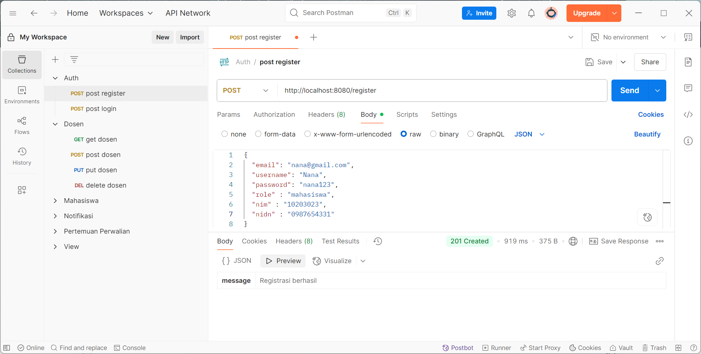

# 🎓 Sistem Perwalian Mahasiswa - Backend

---
## 🧰 Tools yang dibutuhkan ( Backend ) 
1. PHP 8.3.17 ( atau versi lebih tinggi )
2. Visual Studio Code
3. Laragon/XAMPP
4. Composer
5. CodeIgniter
6. Postman untuk testing API
7. MYSQL 

---

## 🔧  Installasi Tools

1. **Install Composer**  
   Download di: [https://getcomposer.org](https://getcomposer.org) 

2. **Install CodeIgniter**  
   Bisa dilakukan melalui Composer dengan perintah:
   ```bash
   composer create-project codeigniter4/appstarter (nama-folder-project) -vvv
   ```
   atau melalui website resmi CodeIgniter di : [https://www.codeigniter.com/download](https://www.codeigniter.com/download)
3. **Install Postman**  
   Postman desktop dapat diunduh melalui website resmi postman yaitu : [https://www.postman.com/downloads/](https://www.postman.com/downloads/)

   ---
## 🚀 Langkah - langkah Backend
1.   Pastikan PHP telah terinstall  
     Menggunakan perintah :
      ```bash
      php -v
      ```
      Notes : Untuk meminimalisir kesalahan dan error maka gunakan versi PHP terbaru
     
2. Pastikan Composer juga telah terinstall  
   Menggunakan perintah :
   ```bash
   composer -v
   ```
   Notes : Composer harus benar benar terinstall agar install CodeIgniter melalui terminal (composer) bisa dilakukan.
   
3. Install CodeIgniter menggunakan composer atau terminal
   Buka terminal lalu ketikkan perintah :
    ```bash
   composer create-project codeigniter4/appstarter (nama-folder-project) -vvv
   ```
   Tunggu proses download package selesai dan jika proses selesai maka folder project CodeIgniter berhasil dibuat.
   
4. Buka folder project CodeIgniter di Visual Studio Code  
   Buka folder project di **C:/laragon/www/**
   
5. Buat Database untuk Uji coba API di lokal  
   Buka phpmyadmin di : [http://localhost/phpmyadmin/](http://localhost/phpmyadmin/)  
   Buat database dengan nama : pbfkel22  
   Buat tabel **users** menggunakan query :
   ```sql
   CREATE TABLE users (
   id_user int auto_increment PRIMARY KEY,
   username varchar(50) not null,
   email varchar(25) not null,
   password varchar(50) not null,
   role varchar(50) not NULL,
   nim char(9),
   nidn char(10),
   CONSTRAINT `users_fk1` FOREIGN KEY (`nim`) REFERENCES `mahasiswa` (`nim`) ON DELETE CASCADE ON UPDATE CASCADE,
   CONSTRAINT `users_fk2` FOREIGN KEY (`nidn`) REFERENCES `dosen_wali` (`nidn`) ON DELETE CASCADE ON UPDATE CASCADE
   );
   ```
   Buat tabel **mahasiswa** dengan perintah :
   ``` sql
   CREATE TABLE mahasiswa (
    nim CHAR(9) PRIMARY KEY,
    nama VARCHAR(50) NOT NULL,
    email VARCHAR(25) NOT NULL,
    alamat TEXT NOT NULL,
    nidn CHAR(10),
    CONSTRAINT mahasiswa_ibfk_1 FOREIGN KEY (nidn) REFERENCES dosen_wali (nidn) 
    ON DELETE CASCADE ON UPDATE CASCADE );
   ```
   Buat tabel **dosen_wali** dengan perintah :
   ```sql
   CREATE TABLE dosen_wali (
   nidn char(10) PRIMARY KEY,
   nama varchar(50) not null,
   email varchar(25) not null
   );
   ```
   Buat tabel **notifikasi** dengan perintah :
   ```sql
   CREATE TABLE notifikasi (
   id_notifikasi int auto_increment PRIMARY KEY,
   tipe varchar(25) not null,
   tanggal_kirim date not null,
   pesan text not null,
   nim char(9),
   nidn char(10),
   CONSTRAINT `notifikasi_ibfk_1` FOREIGN KEY (`nim`) REFERENCES `mahasiswa` (`nim`) ON DELETE CASCADE ON UPDATE CASCADE,
   CONSTRAINT `notifikasi_ibfk_2` FOREIGN KEY (`nidn`) REFERENCES `dosen_wali` (`nidn`) ON DELETE CASCADE ON UPDATE CASCADE
   );
   ```
   Buat tabel **pertemuan_perwalian** dengan perintah :
   ```sql
   CREATE TABLE pertemuan_perwalian (
    id_pertemuan INT AUTO_INCREMENT PRIMARY KEY,
    tanggal DATE NOT NULL,
    topik VARCHAR(255) NOT NULL,
    catatan VARCHAR(255) NOT NULL,
    saran_akademik VARCHAR(150) NOT NULL,
    nim CHAR(9),
    nidn CHAR(10),
    bulan_tahun VARCHAR(10) GENERATED ALWAYS AS (CONCAT(YEAR(tanggal), '-', LPAD(MONTH(tanggal), 2, '0'))) STORED, 
    CONSTRAINT pertemuan_ibfk_1 FOREIGN KEY (nim) REFERENCES mahasiswa (nim) ON DELETE CASCADE ON UPDATE CASCADE,
    CONSTRAINT pertemuan_ibfk_2 FOREIGN KEY (nidn) REFERENCES dosen_wali (nidn) ON DELETE CASCADE ON UPDATE CASCADE,
    UNIQUE (nim, nidn, tanggal) -- Mencegah duplikasi pertemuan pada tanggal yang sama
   );
   ```
6. Arahkan folder project ke database yang sudah dibuat.  
   Pada folder **app/config/database.php** ubah perintah :
   ```bash
    public array $default = [
        'DSN'          => '',
        'hostname'     => 'localhost',
        'username'     => '',
        'password'     => '',
        'database'     => '',
        'DBDriver'     => 'MySQLi',
        'DBPrefix'     => '',
        'pConnect'     => false,
        'DBDebug'      => true,
   ```
   menjadi
   ```bash
    public array $default = [
        'DSN'          => '',
        'hostname'     => 'localhost',
        'username'     => 'root',
        'password'     => '',
        'database'     => 'pbfkel22',
        'DBDriver'     => 'MySQLi',
        'DBPrefix'     => '',
        'pConnect'     => false,
   ```
   Perintah ini akan mengarahkan project ke database yang sudah dibuat yaitu  "pbfkel22".
   
7. Buat arsitektur MVC ( Model dan Controller serta Routes )
   
a. Model  
   Pada folder **app/Models** buat file model untuk setiap tabel untuk mengelola data dari database.  
   - **UserModel** : [UserModel.php](app/Models/UserModel.php)  
   - **MahasiswaModel** : [MahasiswaModel.php](app/Models/MahasiswaModel.php)  
   - **dosen_waliModel** : [DosenWaliModel.php](app/Models/DosenWaliModel.php)  
   - **NotifikasiModel** : [NotifikasiModel.php](app/Models/NotifikasiModel.php)  
   - **pertemuan_perwalianModel** : [PertemuanPerwalianModel.php](app/Models/pertemuan_perwalianModel.php)
   
b. Controller  
Pada folder **app/Controllers** buat file controller yang akan mengatur logika dari aplikasi.  
- **AuthController** : [AuthController.php](app/Controllers/AuthController.php)  
- **DosenWaliController** : [DosenWaliController.php](app/Controllers/DosenWaliController.php)  
- **MahasiswaController** : [MahasiswaController.php](app/Controllers/MahasiswaController.php)  
- **NotifikasiController** : [NotifikasiController.php](app/Controllers/NotifikasiController.php)   
- **PertemuanPerwalianController** : [PertemuanPerwalianController.php](app/Controllers/PertemuanPerwalianController.php)
  
c. Routes  
Routes digunakan untuk membuat url dan controller dapat terhubung.  
Routes dapat ditemukan pada folder **app/config/Routes.php**  
```bash
<?php

use CodeIgniter\Router\RouteCollection;

/**
* @var RouteCollection $routes
*/
$routes->get('mahasiswa', 'MahasiswaController::index');                  
$routes->post('mahasiswa', 'MahasiswaController::store');               
$routes->put('mahasiswa/(:num)', 'MahasiswaController::update/$1');         
$routes->delete('mahasiswa/(:num)', 'MahasiswaController::delete/$1');   

$routes->get('dosen', 'DosenWaliController::index');                  
$routes->post('dosen', 'DosenWaliController::store');                 
$routes->put('dosen/(:num)', 'DosenWaliController::update/$1');        
$routes->delete('dosen/(:num)', 'DosenWaliController::delete/$1');   

$routes->get('notifikasi', 'NotifikasiController::index');                 
$routes->post('notifikasi', 'NotifikasiController::store');                 
$routes->put('notifikasi/(:num)', 'NotifikasiController::update/$1');         
$routes->delete('notifikasi/(:num)', 'NotifikasiController::delete/$1'); 

$routes->get('pertemuan', 'PertemuanPerwalianController::index');                   
$routes->post('pertemuan', 'PertemuanPerwalianController::store');                  
$routes->put('pertemuan/(:num)', 'PertemuanPerwalianController::update/$1');          
$routes->delete('pertemuan/(:num)', 'PertemuanPerwalianController::delete/$1');  

$routes->get('vmahasiswa', 'VMahasiswaController::index');          
$routes->post('vmahasiswa', 'VMahasiswaController::store');           
$routes->put('vmahasiswa/(:num)', 'VMahasiswaController::update/$1');  
$routes->delete('vmahasiswa/(:num)', 'VMahasiswaController::delete/$1');

$routes->get('vnotifikasi', 'VNotifikasiController::index');           
$routes->post('vnotifikasi', 'VNotifikasiController::store');           
$routes->put('vnotifikasi/(:num)', 'VNotifikasiController::update/$1');  

$routes->get('vpertemuan', 'VPertemuanPerwalianController::index');   

$routes->post('register', 'AuthController::register');
$routes->post('login', 'AuthController::login');
```
   8. Jalankan Server di Terminal
```bash
cd C:/laragon/www/(folder-project)
php spark serve
```
---  
## 🖥️ Testing Postman  
1. Login dan Register
   - Endpoint Login : **localhost:8080/login**    
     
   - Endpoint Register : **localhost:8080/register**
      
     
2. Dosen
   - Endpoint Get : **localhost:8080/dosen**
      
   - Endpoint Post : **localhost:8080/dosen**
      
   - Endpoint Put : **localhost:8080/dosen/nidn**
      
   - Endpoint Delete : **localhost:8080/dosen/nidn**
      
     
3. Mahasiswa
   - Endpoint Get : **localhost:8080/mahasiswa**
      
   - Endpoint Post : **localhost:8080/mahasiswa**
      
   - Endpoint Put : **localhost:8080/mahasiswa/nim**
      
   - Endpoint delete : **localhost:8080/mahasiswa/nim**
      
     
4. Pertemuan dan Perwalian
   - Endpoint Get : **localhost:8080/pertemuan**
      
   - Endpoint Post : **localhost:8080/pertemuan**
      
   - Endpoint Put : **localhost:8080/pertemuan/id**
      
   - Endpoint Delete : **localhost:8080/pertemuan/id**
      
     
   


   


   
   
   

   
     
   
    
    
   
   
   
   

      
   


